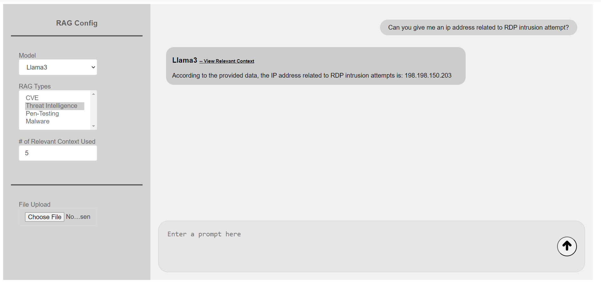
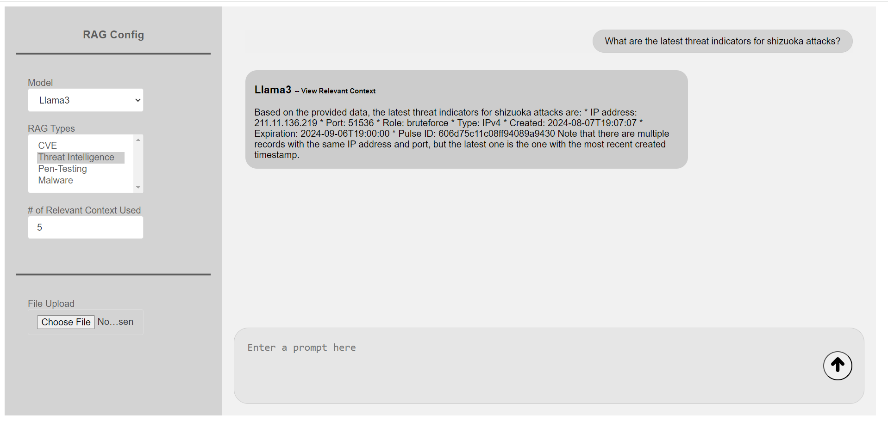

<h1 align="center"> Threat Intelligence RAG </h1>

  

## Overview

This project implements a system for managing Cyber Threat Intelligence by utilizing a Retrieval-Augmented Generation (RAG) model combined with Qdrant and Meta's LLaMA3. The objective is to validate the use of threat indicators extracted from threat intelligence platforms (like AlienVault OTX) and ensure that these indicators are contextually applied within intelligence reports. The system facilitates the extraction, storage, embedding, and querying of threat indicators, enabling efficient analysis and validation using advanced AI models.

Learn more about how to use our Threat Intelligence Rag from our [document](assets/Developing_a_RAG_To_Mitigate_LLM_Hallucinations_in_Threat_Intelligence.pdf).

For a more interactive learning experience, check out our YouTube video
[**How to Use RAG for Threat Intelligence**](https://youtu.be/-jV572DegDA?si=CBBEpUVuFEOJzLtk).

## Examples

#

  

